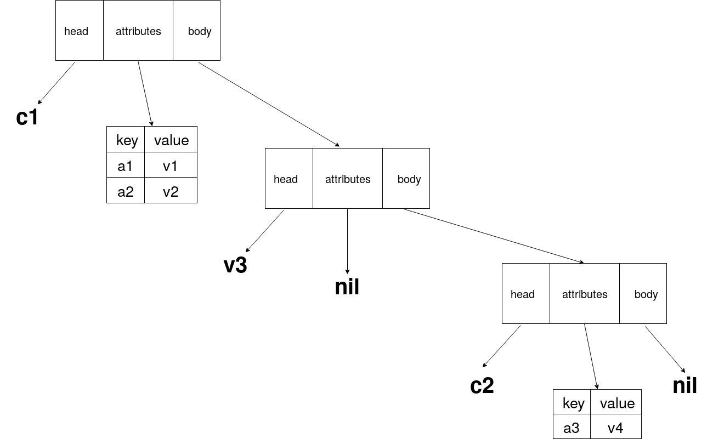

# Tteok 2018 specification

# 목차

* 서문
* 데이터 타입과 값
  * 숫자 타입
  * 숫자 값
  * 문자열 타입
  * 문자열 값
  * 불린 타입
  * 불린 값
  * 함수 타입
  * 함수 값
  * 컨테이너 타입
  * 컨테이너 값
  * 객체 타입
  * 객체 값
  * nil 값
* 추상 명령
* 참조의 표현
* 객체의 기본적인 메서드들
* 함수의 기본적인 메서드들
* 표현식
* 구문
* 배열
* 전역 스코프의 함수
* EBNF
* 선택적 사항

*****
# 서문

> HTML은 프로그래밍 언어인가?

개발자들 사이에서의 흔한 이야기거리지요.
그저 괜찮은 술안주로 끝났었으면 좋았을법한 이 주제가 한 프로그래머에게는 **재밌는 프로젝트** 로 다가오게 됩니다.
그리고 그 프로젝트가 여러 번 뒤집히고 개선된 결과가 여러분이 지금 보고계시는 Tteok 언어입니다.

*****
# 데이터 타입과 값

## 숫자
숫자 타입은 BigFloat 입니다.
> BigFloat이란 오차 없는 부동소수점을 의미합니다.

## 문자열 타입
문자열 타입은 unicode character들의 모임을 나타냅니다.
문자열 타입은 immutable합니다.

## 컨테이너 값
컨테이너 하나는 head, attributes, body라는 세개의 항목을 가집니다.
* head: 컨테이너의 tag name를 가리킵니다.
* attributes: 컨테이너의 tag attribute들로 이루어진 객체를 가리킵니다. 만약 attribute가 없다면 nil를 가리킵니다.
* body: 컨테이너의 body를 가리키며 또다른 컨테이너를 가리킵니다. 만약 비어있다면 nil를 가리키게 됩니다.

예로들어
```html
<c1 a1=v1 a2=v2>
    v3
    <c2 a3=v4></c2>
</c1>
```
와 같은 컨테이너는 다음과 같은 구조를 지닙니다.


